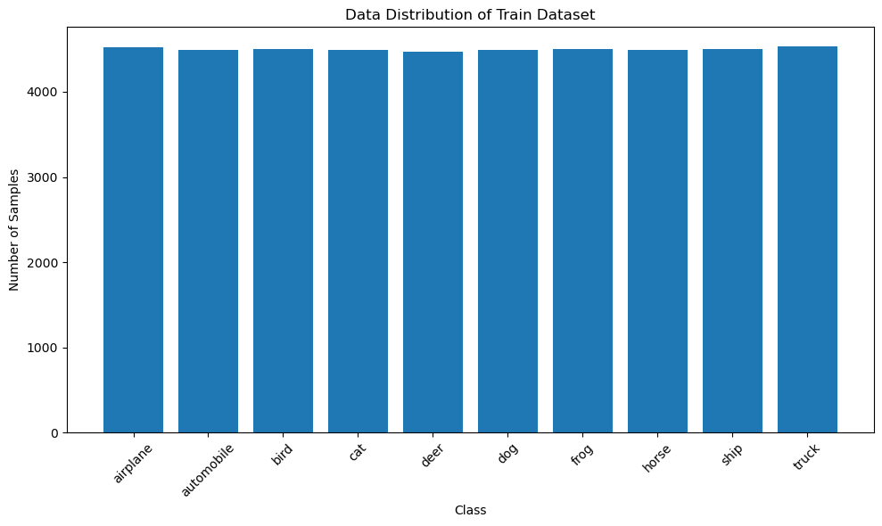
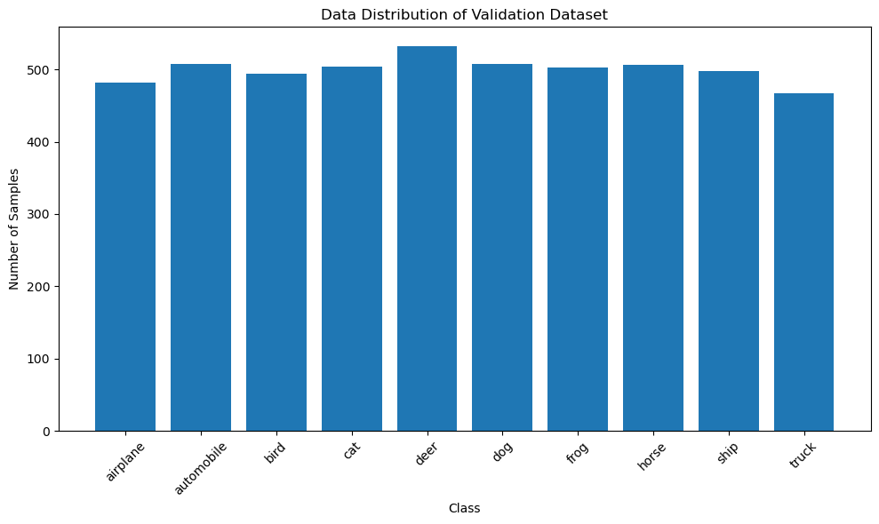
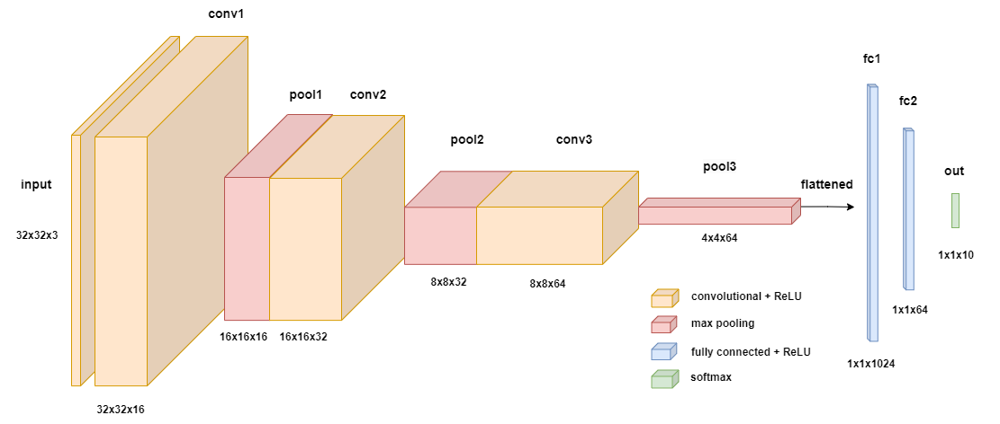

# REWRITE WITH ADVANTAGES AND DISADVANTAGES

### Abstract


Through structured experimentation this assignment explores and demonstrates a number of roperties of artificial Neural networks. Using the CIFAR-10 dataset and classification task and a relatively simple convolutional neural network, the effect that a number of network and paramaeter choices shall be explored. 

Looking first at varying learning rates and learning rate decay then at dropout for regularisation, transfer learning and batch normalisation, it is hoped that a number of important and essential properties shall be described and demonstrated. 

Whilst the aim of the task is not strictly to aim for best peformance, the impacy that the different tecnicques and choices make on performance shall be discussed. 

It shall be shown that.........

training dynamics and performance of    

### Introduction

The labelled CIFAR-10 dataset was created as part of study exploring different approaches to training generative models for natural images [3]. It and it's larger sibling CIFAR-100 have been used for benchmarking and testing in many exploratory and ground breaking papers relating to computer vision and image classification since, not least in the development of Alexnet [x],  Resnet [y] and most recently in the development of  transformer-for vision architectures [z], as well as many others [a, bm c]. It is fitting, then, to use it to explore some of the fundamental properties of aritificial neural networks (NN) in this assignment.

The objective of this assignment examine the impact of NN design choices on performance and gradient flow in a deep convulutional neural network trained to perform multiclass classification on CIFAR images. This shall be done through 3 experiments, each examining a different property of NN model learning. 

The first experiment examined the effect that altering the learning rate has on training and performance. As well as experimenting with different learning rates, a learning rate 'scheduler' was designed and its performance compared to a high performing learning unsscheduled learning. 

The second experiment aimed to understand and demonstrate the impact of introducing a dropout layer into the arhchitecture of the network. Different dropout rates were trialled and their effects compared to baseline performance in both training and evaluation. The effect of dropout was also tested in a transfer learning context.

The third experiment was focused on understanding the effects of both dropout and batch normalisation on gradient flow in the network during backpropagation. It was designed to show the impact that these interventions have on the propogation of the gradient through the different layers of the network at different points of the training cycle. 

The experiments showed.....

### Data

As already mentioned, the data used in this assignment is the CIFAR-10 dataset developed by Krizhevsky and Hinton, et al. [x]. It consists of 60,000 colour 32x32 images, each of which belongs to one 10 mutually exclusive classes and is labelled correspondingly. These classes describe the suject of the image and are: airplane, automobile, bird, cat, deer, dog, frog, horse, ship and truck.

The Cifar-10 dataset, along with many others, is available for download via a conveient Pytorch `datasets` method which uses a boolean flag to enable the user to load both the 50,000 training images and 10,000 test images into separate `torch.Dataset` instances extremely easily, and this was the method used here. As part of this process it is possible to apply manual transforms to the data as it is loaded. Using the `Normalize` method the data so that the pixel values of each of the 3 input channels for all of the datasets has a mean of 0 and and a standard deviation of 1, the idea being to focus the learning on the underlying properties of the data rather than any incidental variance in the raw data.  

The training set consisting of 50,000 labelled samples was then split to create a validation or development set of 5000 samples (with a random seed set for consistence). The final numbers for training, validation and testing then were 45,000, 5,000 and 10,000 respectively. The class distribution for for each dataset were checked and found to be well balanced which means that accuracy should be a reliable measure of overall performance of the model on test data. (althgouh this differed in experiments 2 and 3)

Batching for stochastic gradient descent was handled by the `DataLoader` class, which yields samples from the shuffled dataset without replacement in batches of a size that can be specified by the user until the data has been exhauted. The data is then shuffled again and new batches are drawn from the newly shuffled data so that the batches in every epoch were different, encouraging more stoacasticity - a key element in SGD being said to approximat the true gradient of the loss. 

It was decided that a simple train, validation, test split would be appropriate for the task at hand. Cross-validation is good for getting a very accurate idea of the likely performance of a model on the test set, and exposes the model to all of the possible training data. However, performance was not the chief aim of this assignment - rather it was understanding and the comparison of performance on training, validation and a test set is sifficient.   


<figure><center><figcaption> Figure 1. Dropout is more effective in convolutional layers when applied to whole activation maps. </figcaption></center></figure>


### architecture


<figure><center><figcaption> Figure 1. BaselineNet Convolutional Neural Network. </figcaption></center></figure>


The baseline architecture was designed in accordance with the assigonment brief and some intitial experimentation with hyperparamaters.

The basic architecture visable in Fig 1. shall be outlined in more detail and then reasoning and results that led to some of the decisions shall be discussed.

The inputs to the model are the 32 x 32 colour images which have a depth of 3 owing to the RGB channels. These are convolved with the first convolutional layer `conv1` comprised of 16 filters as outlined in `Table 1` below above. The resultant output was passed through a relu activation and put through a max pooling filter `pool1` which compacts the previous layers spatial dimensions by half whilst preserving the number of channels. It should be noted pooling layers `pool2` and `pool3` perform the same operation and have the same structure. The output of `pool1` was convolved with `conv2` leading to a 32 channel, 16x16 output which were passed through a relu activation followed by another max pooling layer `pool2`. The final convolutional layers `conv3` increased the channel size to 64, before the activations were passed through a relu activation and then max pooled again before being `flattened` and passed to the first fully connected layer `fc1` and through aother relu activation into `fc2` and finally to the 10 dimensional output layer where it goes through a softmax actication.

***<center>Table 1: Convolutional Neural Network Architecture***</center> 

| Layer     |k (n filters) | F (filter dimensions)| S (stride) | P (padding) | Input Dimensions | Output Dimensions |
|-----------|-------------|----------------------|------------|-------------|------------------|-------------------|
| `conv1`   | 16          | 3x3 (x3)                | 1          | 1           | 32x32x3          | 32x32x16          |
| `pool1`   | -           | 2x2 (x16)               | 2          | -           | 32x32x16         | 16x16x16          |
| `conv2`   | 32          | 3x3 (x16)               | 1          | 1           | 16x16x16         | 16x16x32          |
| `pool2`   | -           | 2x2 (x32)               | 2          | -           | 16x16x32         | 8x8x32            |
| `conv3`   | 64          | 3x3 (x32)               | 1          | 1           | 8x8x32           | 8x8x64            |
| `pool3`   | -           | 2x2 (x64)               | 2          | -           | 8x8x64           | 4x4x64            |


The choice of hyperparameters for the BaselineNet architecture were made based on a combination of the assignment brief, initial experimentation, and common practices in the field.

The batch size of 64 was selected as a balance between computational efficiency and the ability to capture a representative sample of the dataset in each iteration. This size allows for efficient data processing on on GPU while providing a reasonable approximation of the gradient during training.

The filter dimensions of 3x3 were chosen as they have been shown to be effective in capturing local spatial patterns while keeping the number of parameters relatively low [VGG???]. 

The increasing number of filters (16, 32, 64) in the convolutional layers allows the network to learn progressively more complex and abstract features as the depth increases. 

The setting the stride combined with a padding of 1 in the convolutional layers ensures that the spatial resolution is preserved, while prevents information loss at the edges. 

The max pooling layers with a pool size of 2x2 and stride of 2 help to reduce the spatial dimensions, thereby reducing the number of parameters and providing a form of translation invariance. 

Overall, these choices strike a balance between model complexity, computational efficiency, and the ability to learn meaningful features from the CIFAR-10 dataset.

Owing to the number of training runs required to get accurate, averages results, parameter size was a legitimate consideration as it impacted on training time signfiriantly.  

```
The choice of ReLU (Rectified Linear Unit) as the activation function throughout the BaselineNet architecture is based on its proven effectiveness and computational efficiency. ReLU has become the default activation function for many deep learning models due to its ability to alleviate the vanishing gradient problem and promote sparse representations [ReLU_Advantages]. It introduces non-linearity into the network, allowing it to learn complex patterns and representations. ReLU is computationally efficient compared to other activation functions like sigmoid or tanh, as it involves a simple thresholding operation. This efficiency enables faster training and inference times. Additionally, ReLU has been shown to accelerate convergence during training by providing a consistent gradient flow [ReLU_Convergence].
Overall, these choices strike a balance between model complexity, computational efficiency, and the ability to learn meaningful features from the CIFAR-10 dataset. Owing to the number of training runs required to get accurate, averages results, parameter size was a legitimate consideration as it impacted on training time signfiriantly.
```


### Loss

The loss function used for each experiment was cross-entropy loss, implimented using the `nn.CrossEntropyLoss` class from Pytorch [x].

It is widely used method for quantifying loss function for classification problems such as this where the target is binomial or miultinomial. Cross-entropy works on logits that have been transformed by a softmax activation into what is a effectively a probability distribution across the output classes. It compares this output probability distribution to a one-hot encoded version of the class label, where the value at the index for the true class is 1, and all the others are 0. This acts as a target probability distribution and the cross entropy loss calculation function essentially quantifies the difference between this predicted distribution and the one-hot encoded true label distribution. 

Mathematically, for a single sample with true label $y$ and predicted probabilities $\hat{y}$, the cross-entropy loss is calculated as:
$$\text{CE}(y, \hat{y}) = -\sum_{i=1}^{C} y_i \log(\hat{y}_i)$$

where $C$ is the number of classes, $y_i$ is the true label (0 or 1) for class $i$, and $\hat{y}_i$ is the predicted probability for class $i$. By minimizing the average cross-entropy loss over all training samples, the model learns to assign high probabilities to the correct class and low probabilities to the incorrect ones.

The logarithm in the formula strongly penalizes misclassifications and encourages the model to produce well-calibrated probability estimates. Cross-entropy is a principled and effective loss function for multi-class classification, aligning with the maximum likelihood estimation objective. It drives the model to minmise the difference between its output probabilities and the true class probability, encouraging it to learn a mapping from features to the correct output probabilities. 

Practically, the use of the Pytorch module precludes the need for a softmax layer in the model architecture itself as the optimiser takes in the raw logits and then applys the `nn.LogSoftmax()` activation function [x] and the `nn.NLLLoss()` [x] (Negative Log-Likelihood Loss) in a single operation that encapsulates the above. The function used as it is here in a mini-batch stochastic gradient decent context also handles the averaging of the loss across the mini-batch. This averaging is important because it allows the loss to be invariant to the batch size and provides a stable estimate of the overall loss for the batch and then across batches in the epoch.


### Optimiser

The optmiser used to handle parameter updates and impliment gradient descent was stochastic gradient descent (SGD), implimented using the `optim.SGD` class from Pytorch. 

SGD is the most straighforward and in many ways the original optimiser in artiificial neural networks. Aside from pure gradient descent calculated as an average of the gradients for the entire training dataset, it is as straightforward an approach to optimisation as one can use.

As an approach the idea is that it estimates the true gradient of the loss function using a small subset of the training data (a mini-batch) and update the parameters with this approximate gradient, weighted by a learning rate which, in this approach, is fixed, and user defined. 

This process is repeated for multiple mini-batch samples taken from the training data without replacement (until the entire data set has been seen - representing an 'epoch' of training) and then repeated until a stopping criterion is met - in this case a set number of epochs.

Mathematically, the estimated gradient for a mini-batch of size $B$ sampled from the training data is computed as:
$$\nabla_\theta L(\theta_t) \approx \frac{1}{B} \sum_{i=1}^{B} \nabla_\theta L(\theta_t; x_i, y_i)$$
where $(x_i, y_i)$ represents the $i$-th example in the mini-batch.

There a number of more sophiticated optimisers availabl when training NNs today, not least the 'Adam' (Adaptive moment Estimation) optimiser [x] which is near uniquitous and recommended for most cases is "one of the more robust and effective optimization algorithms to use in deep learning" [x]. These approaches, by encoporating properties such as the 'momentum' of the gradient, as well as adaptive learning rates have been shown to allow for a smoother and more direct journey through paramater space to the miminimum loss. However, one of the objective was to explore the effect of the learning rate on performance, and with SGD the paramaters are directly updated the parameters based only on the gradient and the learning rate. By keeping to this very direct forumlation it easier to understand and interpret the impact of the learning rate on the model's performance - the learning rate has a clear and direct influence on the step size of the parameter updates, making it straightforward to study its effect. SGD is highly sensitive to the choice of the learning rate and this sensitivity is precisely what makes SGD suitable for studying the impact of learning rate on model performance. By varying the learning rate and observing the corresponding changes in model behavior, you can gain insights into the optimal learning rate range and its effect on convergence speed and generalization. The absence of adaptive learning rates in SGD in particular  ensures that the learning rate remains consistent throughout the training process.
This consistency allows for a clearer analysis of the relationship between the learning rate and model performance, without the confounding effects of adaptive learning rate schedules.

An interesting furthe development would be to introduce momentum and compare performance, then try Adagrad, then try Adam. But as the aim is just to explore learning rate, I felt it better to keep the optimiser algorithm as simple as possible. 

